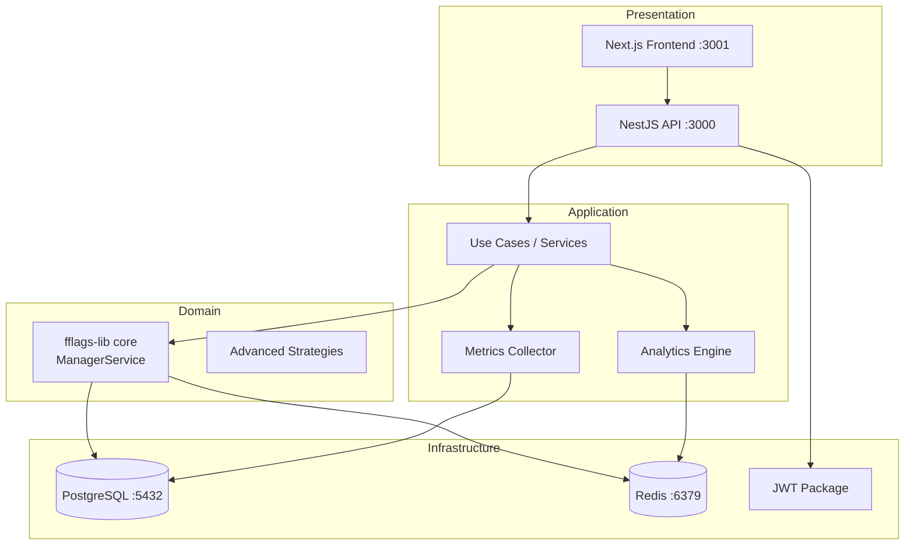

# Feature Flags Manager

Sistema completo de gestión de feature flags construido sobre **fflags-lib**, con métricas avanzadas, analytics, API REST (NestJS) y frontend web (Next.js). Sigue principios de **Arquitectura Hexagonal**, **DDD** y **TDD**.

## Tabla de Contenidos

- [Arquitectura](#arquitectura)
- [Estructura del Monorepo](#estructura-del-monorepo)
- [Stack Tecnológico](#stack-tecnológico)
- [Setup Local](#setup-local)
- [Variables de Entorno](#variables-de-entorno)
- [API Endpoints](#api-endpoints)
- [Estrategias de Activación](#estrategias-de-activación)
- [Testing](#testing)
- [Documentación Adicional](#documentación-adicional)

---

## Arquitectura

El sistema sigue una **arquitectura hexagonal (Ports & Adapters)** con tres capas:



### Componentes principales

| Componente | Responsabilidad |
|---|---|
| **fflags-lib** | Motor core CRUD de feature flags (npm package) |
| **Metrics Collector** | Recopila eventos de evaluación (batch async) |
| **Analytics Engine** | Procesa y agrega métricas por time window |
| **API REST** | Wrapper NestJS, autenticación JWT, DTOs validados |
| **Web Frontend** | Gestión visual con Next.js + React |
| **JWT Package** | Autenticación y autorización en `libs/infrastructure/@org/jwt` |

---

## Estructura del Monorepo

```
feature-flags-platform/
├── apps/
│   ├── api/                    # NestJS REST API (puerto 3000)
│   │   └── src/app/
│   │       ├── auth/           # Módulo de autenticación JWT
│   │       ├── feature-flags/  # Módulo principal de feature flags
│   │       │   ├── domain/     # Interfaces y tipos de dominio
│   │       │   ├── application/ # Casos de uso y servicios
│   │       │   └── infrastructure/ # Controladores, DTOs, repositorios
│   │       └── health.controller.ts
│   └── web/                    # Next.js Frontend (puerto 3001)
├── libs/
│   ├── domain/                 # Entidades y value objects compartidos
│   ├── application/            # Casos de uso compartidos
│   └── infrastructure/
│       └── @org/jwt/           # Paquete JWT reutilizable
├── scripts/
│   └── database/
│       └── init.sql            # Schema PostgreSQL inicial
├── docker-compose.yml
├── .env.example
└── docs/
    ├── examples/               # Ejemplos de código TypeScript
    ├── strategies.md           # Documentación de Flag_Strategy types
    └── database-schema.md      # Diagrama ER del esquema de BD
```

---

## Stack Tecnológico

| Capa | Tecnología |
|---|---|
| **API** | NestJS 11, TypeScript, fflags-lib |
| **Frontend** | Next.js 16, React 18, TypeScript |
| **Auth** | @nestjs/jwt, RS256/HS256 |
| **Persistencia** | PostgreSQL 15+ (via fflags-lib) |
| **Caché** | Redis 7+ (via fflags-lib) |
| **Validación** | class-validator, class-transformer |
| **Testing** | Jest, Supertest, fast-check |
| **Infraestructura** | Docker, Docker Compose, NX monorepo |

---

## Setup Local

### Prerrequisitos

- Node.js 20+
- Docker & Docker Compose
- npm 10+

### 1. Clonar e instalar dependencias

```bash
git clone <repo-url>
cd feature-flags-platform
npm install
```

### 2. Configurar variables de entorno

```bash
cp .env.example .env
# Editar .env con tus valores si es necesario
```

### 3. Levantar la infraestructura Docker

```bash
docker compose up -d
```

Esto arranca PostgreSQL (`:5432`) y Redis (`:6379`) con health checks. El esquema de la BD se inicializa automáticamente desde `scripts/database/init.sql`.

### 4. Arrancar la API

```bash
npx nx serve api
# La API estará disponible en http://localhost:3000/api
# Swagger UI disponible en http://localhost:3000/api/docs
```

### 5. Arrancar el Frontend (opcional)

```bash
npx nx serve web
# Disponible en http://localhost:3001
```

### 6. Arrancar todo a la vez

```bash
npm run serve:all
```

---

## Variables de Entorno

Todas las variables disponibles en `.env.example`:

| Variable | Por defecto | Descripción |
|---|---|---|
| `POSTGRES_HOST` | `localhost` | Host del servidor PostgreSQL |
| `POSTGRES_PORT` | `5432` | Puerto de PostgreSQL |
| `POSTGRES_USER` | `postgres` | Usuario de PostgreSQL |
| `POSTGRES_PASSWORD` | `postgres` | Contraseña de PostgreSQL |
| `POSTGRES_DB` | `fflags_db` | Nombre de la base de datos |
| `REDIS_HOST` | `localhost` | Host del servidor Redis |
| `REDIS_PORT` | `6379` | Puerto de Redis |
| `REDIS_PASSWORD` | *(vacío)* | Contraseña de Redis (opcional) |
| `REDIS_TTL` | `3600` | TTL de caché en segundos |
| `JWT_SECRET` | — | Secret para firmar tokens JWT (obligatorio en producción) |
| `PORT` | `3000` | Puerto de la API NestJS |

> **Nota:** En el entorno de desarrollo con Docker, los valores por defecto del `.env.example` funcionan directamente.

---

## API Endpoints

La documentación completa e interactiva está disponible en **Swagger UI**: `http://localhost:3000/api/docs`

Todos los endpoints (excepto `/health`) requieren un **Bearer token JWT** en el header `Authorization`.

| Método | Endpoint | Rol | Descripción |
|---|---|---|---|
| `GET` | `/api/health` | — | Estado del sistema |
| `POST` | `/api/feature-flags` | admin | Crear un feature flag |
| `GET` | `/api/feature-flags` | admin/viewer | Listar flags (paginado) |
| `GET` | `/api/feature-flags/:key` | admin/viewer | Obtener un flag por key |
| `PUT` | `/api/feature-flags/:key` | admin | Actualizar un flag |
| `DELETE` | `/api/feature-flags/:key` | admin | Eliminar un flag |
| `POST` | `/api/feature-flags/:key/evaluate` | admin/viewer | Evaluar un flag |
| `GET` | `/api/feature-flags/:key/metrics` | admin/viewer | Métricas del flag |
| `GET` | `/api/feature-flags/:key/analytics?window=24h` | admin/viewer | Analytics del flag |

**Ventanas de tiempo** para métricas y analytics: `1h`, `24h`, `7d`, `30d`

Ver ejemplos de código en [`docs/examples/basic-usage.ts`](docs/examples/basic-usage.ts).

---

## Estrategias de Activación

El sistema soporta 4 tipos de **Flag_Strategy**:

| Tipo | Campo clave | Descripción |
|---|---|---|
| `PERCENTAGE` | `rolloutPercentage` | Habilita para un % de usuarios (hashing consistente) |
| `USER_LIST` | `userIds`, `isBlacklist` | Whitelist o blacklist de usuarios |
| `TIME_WINDOW` | `startTime`, `endTime` | Activo solo en un rango de tiempo (ISO 8601) |
| `COMPOSITE` | `operator`, `strategies` | Combina estrategias con `AND` / `OR` |

Ver documentación detallada con ejemplos JSON en [`docs/strategies.md`](docs/strategies.md).

---

## Testing

### Ejecutar todos los tests

```bash
npm test
# o equivalente:
npx nx run-many -t test
```

### Tests específicos por proyecto

```bash
# Tests de la API
npm run test:api

# Tests de las libs (domain, application, infrastructure)
npm run test:libs

# Tests en modo watch (para desarrollo)
npm run test:watch
```

### Tipos de tests

| Tipo | Ubicación | Framework |
|---|---|---|
| **Unit tests** | `*.spec.ts` junto al código | Jest |
| **Integration tests** | `*.integration.spec.ts` | Jest + mocks |
| **Property-based tests** | `*.prop.spec.ts` | Jest + fast-check |
| **E2E tests** | `apps/api-e2e/`, `apps/web-e2e/` | Jest + Supertest |

### Cobertura de código

```bash
npx nx test api --coverage
```

El objetivo es mantener **≥ 80%** de cobertura en todas las capas (Domain, Application, Infrastructure).

### Estrategia de dobles de test

- **Mocks**: para aislar casos de uso de repositorios externos
- **Stubs**: para simular respuestas predecibles de servicios
- **In-memory repositories**: implementaciones ligeras de repositorios para tests de integración sin BD real

---

## Documentación Adicional

| Documento | Descripción |
|---|---|
| [`docs/examples/basic-usage.ts`](docs/examples/basic-usage.ts) | Ejemplos de código TypeScript para casos de uso comunes |
| [`docs/strategies.md`](docs/strategies.md) | Ejemplos JSON de cada tipo de Flag_Strategy |
| [`docs/database-schema.md`](docs/database-schema.md) | Diagrama ER del esquema de base de datos |
| [Swagger UI](http://localhost:3000/api/docs) | Documentación interactiva de la API REST (requiere servidor) |
