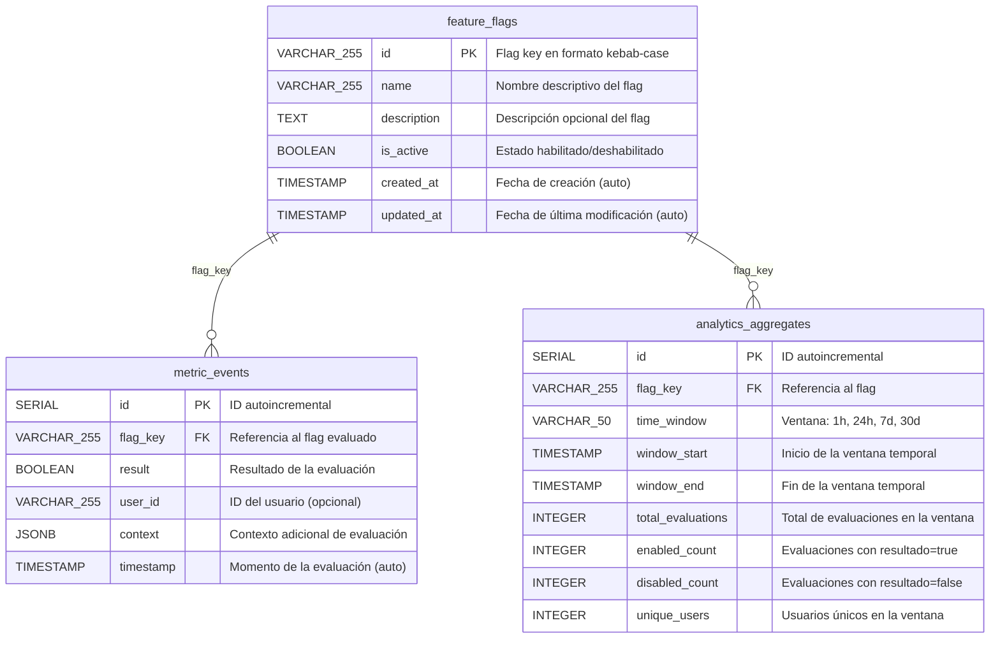

# Esquema de Base de Datos

El sistema utiliza **PostgreSQL 15+** como almacén principal. El esquema se inicializa automáticamente desde `scripts/database/init.sql` al arrancar el contenedor Docker.

## Diagrama ER



---

## Descripción de tablas

### `feature_flags`

Tabla principal gestionada por **fflags-lib**. Almacena la configuración de cada flag.

| Columna | Tipo | Descripción |
|---|---|---|
| `id` | `VARCHAR(255)` | **PK** — Flag key en formato kebab-case (ej: `my-new-feature`) |
| `name` | `VARCHAR(255)` | Nombre descriptivo del flag |
| `description` | `TEXT` | Descripción opcional del propósito del flag |
| `is_active` | `BOOLEAN` | Estado del flag (`false` por defecto) |
| `created_at` | `TIMESTAMP` | Fecha de creación (auto-generada) |
| `updated_at` | `TIMESTAMP` | Fecha de última modificación (auto-actualizada) |

**Índices:**
- `idx_feature_flags_is_active` — Optimiza consultas de flags activos

---

### `metric_events`

Tabla de la extensión **Metrics Collector**. Registra cada evaluación de un flag de forma asíncrona y en batch.

| Columna | Tipo | Descripción |
|---|---|---|
| `id` | `SERIAL` | **PK** — ID autoincremental |
| `flag_key` | `VARCHAR(255)` | **FK** → `feature_flags.id` |
| `result` | `BOOLEAN` | Resultado de la evaluación (`true`/`false`) |
| `user_id` | `VARCHAR(255)` | ID del usuario que evaluó (opcional) |
| `context` | `JSONB` | Atributos adicionales del contexto de evaluación |
| `timestamp` | `TIMESTAMP` | Momento exacto de la evaluación |

**Índices:**
- `idx_metric_events_flag_key` — Consultas de métricas por flag
- `idx_metric_events_timestamp` — Consultas por rango de tiempo
- `idx_metric_events_flag_timestamp` — Consultas combinadas (flag + time window) — **índice compuesto**

**Comportamiento:**
- Los eventos se acumulan en memoria (batch de hasta 100 eventos o 10 segundos)
- Se persisten asíncronamente con reintentos exponenciales (hasta 3 intentos)

---

### `analytics_aggregates`

Tabla de la extensión **Analytics Engine**. Almacena datos pre-agregados por flag y ventana temporal para mejorar el rendimiento de las consultas de analytics.

| Columna | Tipo | Descripción |
|---|---|---|
| `id` | `SERIAL` | **PK** — ID autoincremental |
| `flag_key` | `VARCHAR(255)` | **FK** → `feature_flags.id` |
| `time_window` | `VARCHAR(50)` | Tipo de ventana: `1h`, `24h`, `7d`, `30d` |
| `window_start` | `TIMESTAMP` | Inicio del período agregado |
| `window_end` | `TIMESTAMP` | Fin del período agregado |
| `total_evaluations` | `INTEGER` | Total de evaluaciones en la ventana |
| `enabled_count` | `INTEGER` | Evaluaciones con resultado `true` |
| `disabled_count` | `INTEGER` | Evaluaciones con resultado `false` |
| `unique_users` | `INTEGER` | Usuarios únicos que evaluaron el flag |

**Restricción UNIQUE:** `(flag_key, time_window, window_start)` — evita duplicados en la agregación.

**Índices:**
- `idx_analytics_aggregates_query` — Índice compuesto sobre `(flag_key, time_window, window_start)`

---

## Estrategia de caché

Además de PostgreSQL, el sistema usa **Redis 7+** como capa de caché:

| Clave Redis | TTL | Descripción |
|---|---|---|
| `flag:{key}` | `REDIS_TTL` (default 3600s) | Flag completo serializado (gestionado por fflags-lib) |
| `analytics:{flagKey}:{window}` | `60s` | Resultados de analytics por flag y ventana |

Cuando Redis no está disponible, el sistema continúa operando directamente contra PostgreSQL (fallback automático de fflags-lib).

---

## Script de inicialización

El archivo [`scripts/database/init.sql`](../scripts/database/init.sql) crea todas las tablas e índices automáticamente al arrancar el contenedor Docker de PostgreSQL.

Para ejecutar manualmente en un entorno existente:

```bash
psql -h localhost -U postgres -d fflags_db -f scripts/database/init.sql
```
